# Database / Collection / Document 생성과 제거

Database < Collection < Document 의 크기로 나눌수 있다.  

## Database 생성

Database를 생성할 때에는 `use`명령어를 사용하면 됩니다.  
이미 Database가 있는 경우에는 해당 datavase로 사용을 합니다.  

터미널을 통하여 test를 해보겠습니다.  
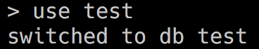  

`db`라는 명령어를 통해 내가 지금 있는 db를 확인할 수 있습니다.  
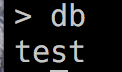  

`show dbs`를 사용하면 데이터베이스 리스트들을 확인할 수 있습니다.  
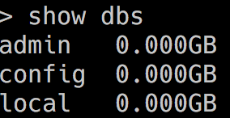

그런대 이때에는 위에서 만든 `test` 데이터베이스가 없는 것을 확인할 수 있습니다. 그 이유는 새로만든 데이터베이스를 리스트에서 불러오려면 최소한 한개의 Document를 추가해주어야 합니다.  
`db.원하는 db이름.insert({원하는 document 리스트})`이런식으로 넣어 주면 됩니다. 넣어준 후  `show dbs`로 확인을 해보면 잘 들어갔다는 것을 보여줍니다.    
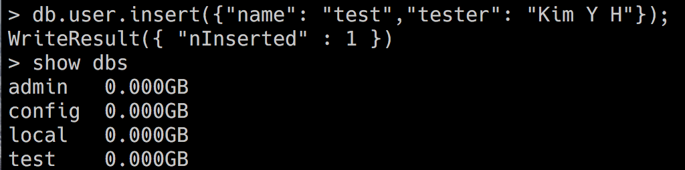  

## Database 제거

Database를 제거할 때 사용하는 명령어는 `db.dropDatabase()`를 사용하면 됩니다. 이 때 주의사항으로는 `use 원하는 데이터베이스명`을 사용하여 삭제를 원하는 database로 가야합니다.  
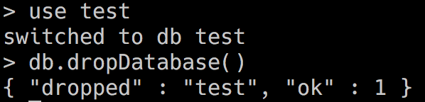  

## Collection 생성

Collection을 생성할 때에는 `db.createCollection(name, [options])`명려어를 사용합니다.  
`name`에는 생성하려는 Collection 이름을 사용하고 options은 document 타입으로 구성된 해당 컬렉션의 설정값입니다.  
option 매개변수는 선택적인 매개변수로서 생략해도 되고, 필요에 따라 사용하면 됩니다.  

### Option의 종류
| Field | Type | 설명 |
|---|---|---|
| capped | Boolean | 이 값을 true로 설정하면 capped collectiion을 활성화 시킵니다. Capped Collection 이란, Fixed size를 가진 컬렉션으로서, size가 초과되면 가장 오래된 데이터를 덮어씁니다. 이 값을 true로 설정하면 size 값을 꼭 설정해야합니다. |
| autoIndex | Boolean | 이 값을 true로 설정하면 -id 필드에 index를 자동으로 생성합니다. 기본값은 false입니다. |
| size | Number | Capped Collection을 위해 해당 컬렉션의 최대 사이즈를 ~bytes로 지정합니다. |
| max | Number | 해당 컬렉션에 추가 할 수 있는 최대 갯수를 설정합니다. |
||||

### 1. test 데이터베이스에 option이 없이 collection을 생성하는 방법

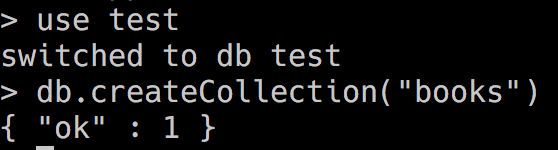

### 2. test 데이터베이스에 option이 있이 collection을 생성하는 방법

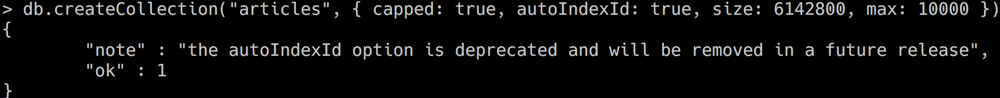

### 3. 따로 `createCollection()`메소드를 사용하지 않아도 document를 추가하면 자동으로 컬렉션이 생성됩니다.  

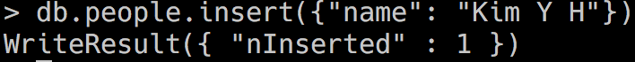

내가 만든 collection 리스트를 확인하려면 `show collection`명령어를 입력하면 됩니다.  
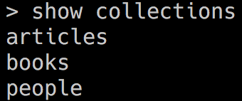

## Collection 제거

Collection 제거 할 땐 `drop()` 메소드를 사용합니다.  
이 명령어도 원하는 Database를 우선적으로 선택해준 후 데이터베이스를 설정해줘야 합니다.  

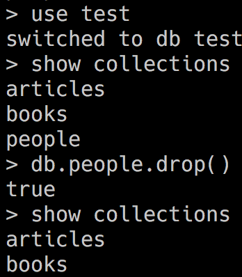

## Document 추가

Document를 추가할 때에는 `insert()`메소드를 사용합니다.  
`db.collection_name.insert(document)` 이런 식으로 사용합니다.  

### 1. 한개의 Document를 books collection에 추가합니다.  

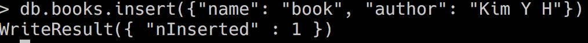

### 2. 두개의 Document를 books collection에 추가합니다.

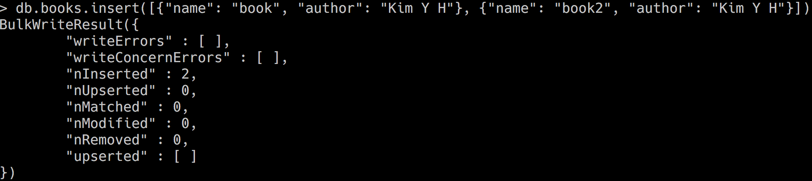

Collection의 Document list를 확인할때 `db.Collection_name.find()`명령어를 사용합니다.  

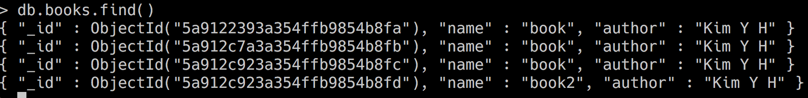

## Document 제거


Document를 제거할 때에는 `remove(criteria, justOne)`메소드를 사용하여 제거할 수 있습니다.  

| parameter | type | 설명 |
|--|--|--|
| criteria | document | 삭제 할 데이터의 기준값입니다. 이 값이 {}이면 컬렉션의 모든 데이터를 제거합니다. |
| justOne | boolean | 선택적 매개변수이며 이값이 true이면 1개의 다큐먼트만 제거합니다. 이 매개변수가 생략되면 기본값은 false로 서, criteria에 해당되는 모든 다큐먼트를 제거합니다. |
||||  

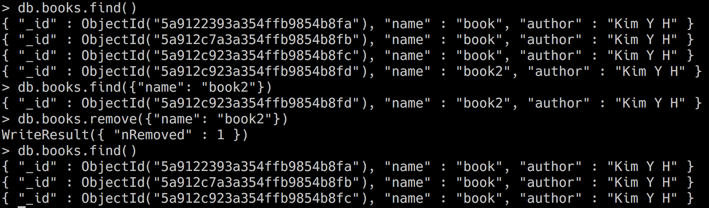  

## Document 조회

Document를 조회할 때에는 `db.collection_Name.find(query, projection)`메소드를 사용하여 조회를 합니다.  

| parameter | type | 설명 |
|--|--|--|
| query | document | 선택적입니다. 다큐먼트를 조회할 때 기준을 정합니다. 기준이 없이 컬렉션에 있는 모든 다큐먼트를 조회할 때는 이 매개변수를 비우거나 비어있는 다큐먼트 {}를 전달하세요. |
| projection | document | 선택적입니다. 다큐먼트를 조회할 때 보여질 field를 정합니다. |
||||

일단 조회를 하려면 데이터를 추가시켜 주어야하는데요. 이 때에는 `db.collection_Name.insert([{datas}])`를 사용하여 넣어주시면 됩니다.  

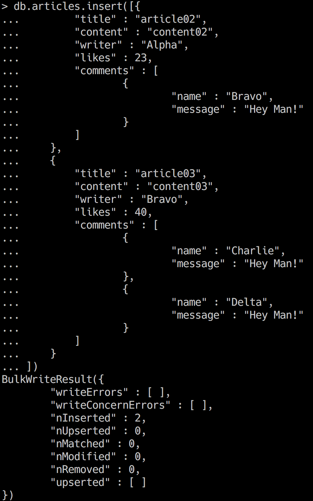  

위의 사진과 같이 목업데이터를 생성해줍니다. 이제 `find`메소드를 사용하여 document를 조회해보겠습니다.  

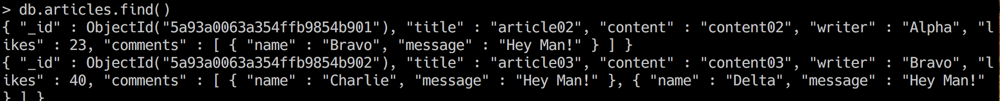

이번에는 다큐먼트를 깔끔하게 조회를 해볼탠데 이 때에는 `find()`메소드 뒤에 `.pretty()`메소드를 붙여주면 됩니다.  

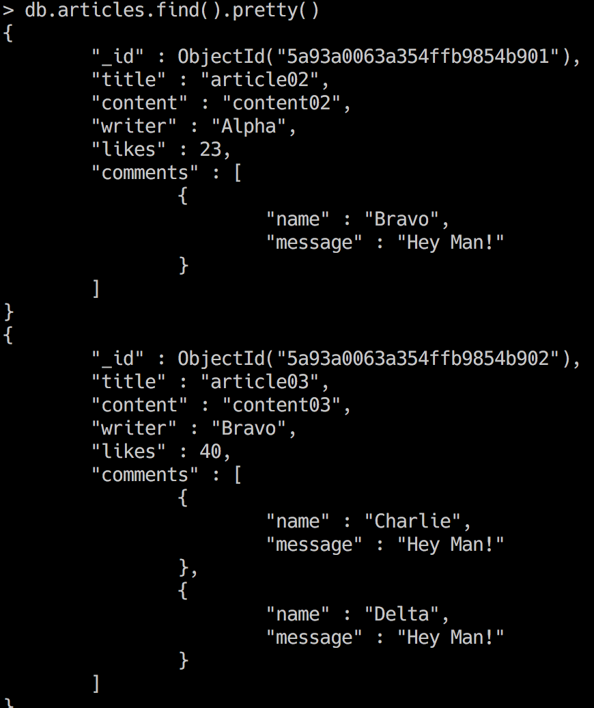

원하는 document를 조회해보겠습니다. 이 때는 `find()`메소드의 ()안에 `{key: value}`를 작성해주면 됩니다.  

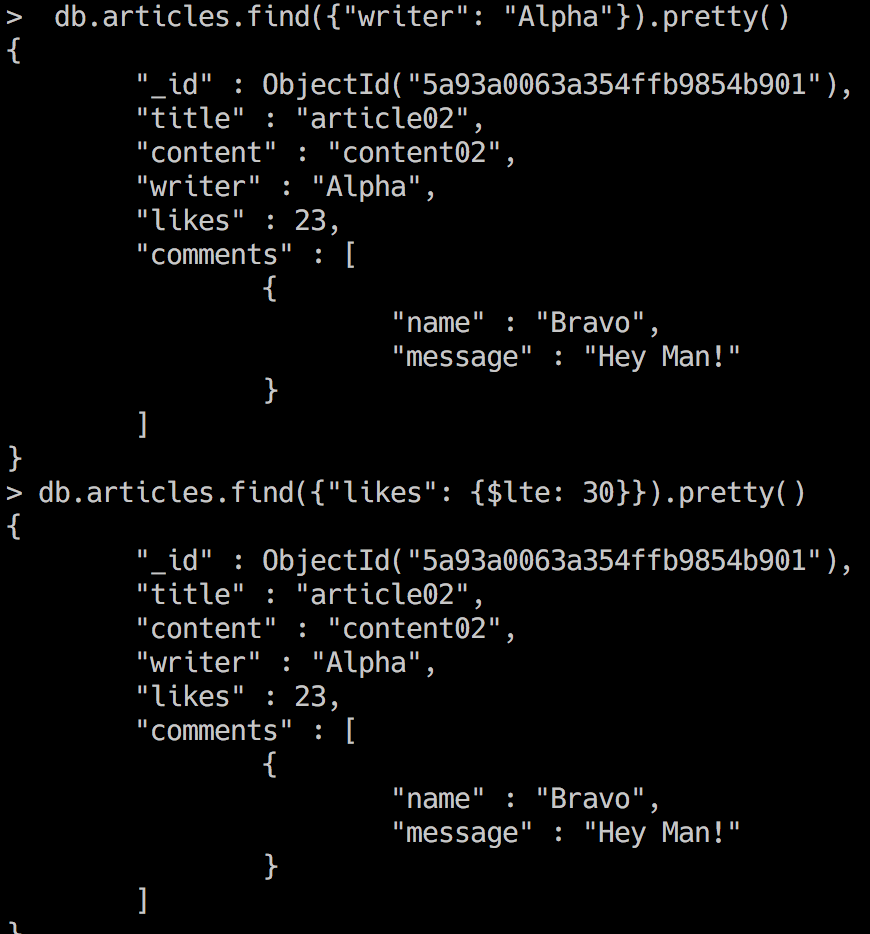

위의 사진에서 like가 30이하인 데이터를 가지고 있는 값을 가져오는 query를 사용하였는데 이때 사용된 query `$lte`는 mongoDB에서 사용하는 query비교 연산자 중 하나입니다.  

### MongoDB에서 사용하는 Query연산자를 알아보겠습니다.  

1. 비교 연산자  

| parameter | 설명 |
|--|--|
| $eq | (equals) 주어진 값과 일치하는 값 |
| $gt | (greater than) 주어진 값보다 큰 값 |
| $gte | (greater than or equals) 주어진 값보다 크거나 같은 값 |
| $lt | (less than) 주어진 값보다 크거나 같은 값 |
| $lte | (less than or equals) 주어진 값보다 작거나 같은 값 |
| $ne | (not equals) 주어진 값과 일치하지 않는 값 |
| $in | 주어진 배열 안에 속하는 값 |
| $nin | 주어진 배열 안에 속하지 않는 값 |
|||

2. 논리 연산자

| parameter | 설명 |
|--|--|
| $or | 주어진 조건 중 하나라도 true일 때 true |
| $and | 주어진 모든 조건이 ture일 때 true|
| $not | 주어진 조건이 false일 때 true |
| $nor | 주어진 모든 조건이 false일 때 true |
|||

3. `$regex` 연산자

`$regex`연산자를 통하여 Document를 정규식을 통해 찾을 수 있습니다.  
```
{ <field>: { $regex: /pattern/, $options: '<options>' } }
{ <field>: { $regex: 'pattern', $options: '<options>' } }
{ <field>: { $regex: /pattern/<options> } }
{ <field>: /pattern/<options> }
```
위에서 보는것과 같이 `$regex`와 `$options`를 생략하고 사용할 수 있습니다. 여기서 `$options`에 들어가는 것은 아래와 같습니다.  

| option | 설명 |
|--|--|
| i | 대소문자 무시 |
| m | 정규식에서 anchor(^)를 사용할 때 값에 \n이 있다면 무력화 |
| x | 정규식 안에 있는 whitespace를 모두 무시 |
| s | dot(.) 사용할 때 \n을 포함해서 매치 |
|||

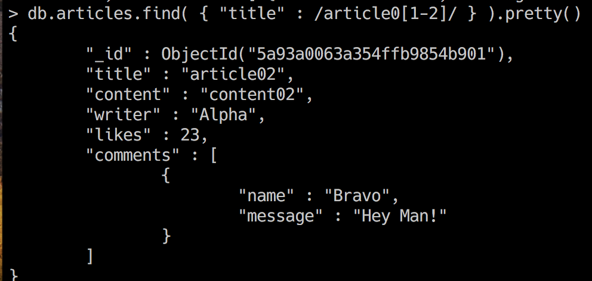


4. `$where` 연산자

`$where`연산자를 통하여 javascript expression을 사용 할 수 있습니다.

5. `$elemMatch` 연산자

`$elemMatch` 연산자는 Embedded Documents 배열을 쿼리할때 사용됩니다. 저희 mock-up data 에서는 comments 가 Embedded Document에 속합니다.  

### MongoDB에서 사용하는 Projection에 대해 알아보도록 하겠습니다.

`find()`메소드의 두번째 parameter인 projection은 쿼리의 결과값에서 보여질 field를 정하는 파라미터입니다.  

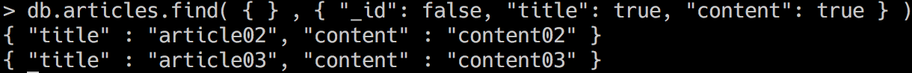

1. `$slice`연산자

projector 연산자 중 $slice 연산자는 Embedded Document 배열을 읽을때 limit 설정을 합니다.  

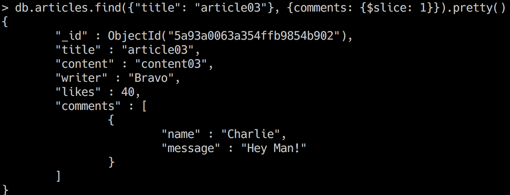  

2. `$elemMatch` 연산자

query 연산자 중 `$elemMatch`와 사용법은 같습니다. 단 역할이 다릅니다.  

